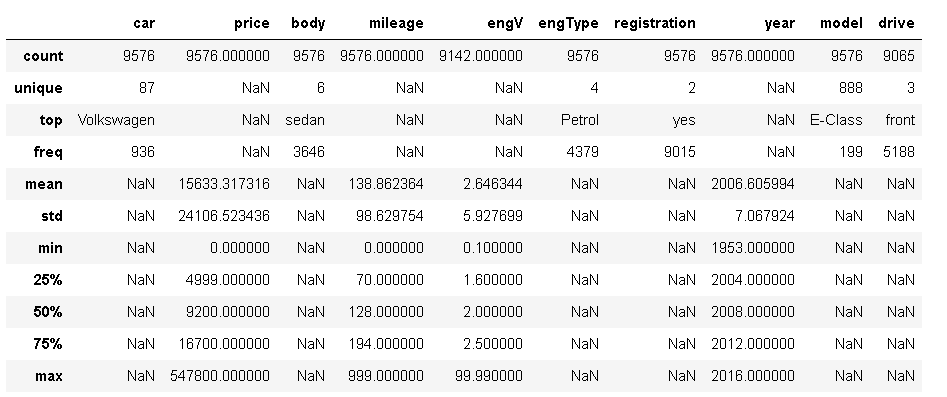

# Introduction to intellectual systems
# Final project
> In this project, we will perform preliminary processing of the data set and then the selected data processing, and finally post-processing the results. 
The project will contain all the necessary comments and explanations. The data will also be visible for better understanding.
In order for it to run non-stop for presentation purposes only, we will assume that some manual action was taken where expected (i.e., data processing and decision making)

# Submitters:
[Andrey Dodon](https://www.kaggle.com/andreydodon) - `M.Sc student, Intellectual systems`

[Michael Gudovsky](https://il.linkedin.com/in/michael-gudovsky-1392157b) - `M.Sc student, Intellectual systems`

# Resources:
  - [Kaggle](https://www.kaggle.com/antfarol/car-sale-advertisements/download) - Anton Bobanov's dataset
  - Python libraries:
    * [pandas](https://pandas.pydata.org/)
    * [scikit-learn](https://scikit-learn.org/stable/)
    * [Statsmodel](https://www.statsmodels.org/stable/index.html)
    * [Matplotlib](https://matplotlib.org/)
    * [Seaborn](https://seaborn.pydata.org/)
  - [PyCharm](https://www.jetbrains.com/pycharm/download/#section=windows) and [Anakonda](https://www.anaconda.com/products/individual) as an IDE  
  

# Project brief:
- Preprocessing steps:
    * Load the Data
    * Discovering the Data
    * Handling Missing Values
    * Dealing with Outliers
    * Multicollinearity - a phenomenon in which two or more predictor variables 
						  in a multiple regression model are highly correlated, 
						  so that the coefficient estimates may change erratically 
						  in response to small changes in the model or data.
    * Dealing with Categorical Values
    * Standardization
- Processing:
    * k-Nearest Neighbors
- Postprocessing metrics:
    * Precision
    * Recall
    * F1 Score
    * ROC AUC

# Load the Data:
| car | price | body | mileage | engV | engType| registration | year | model | drive |
| --- | ----- | ---- | ------- | ---- | -------| ------------ | ---- | ----- | ----- |
|Ford 		  | 15500 	|crossover|68	|2.5	|Gas   |	yes|	2010|	   Kuga|	 full|
|Mercedes-Benz|	20500	|sedan	  |173	|1.8	|Gas   |	yes|	2011|	E-Class|	rear |
|Mercedes-Benz|	35000	|other	  |135	|5.5	|Petrol|	yes|	2008|	CL	550|	rear |
|Mercedes-Benz|	17800	|van	  |162	|1.8	|Diesel|	yes|	2012|	B	180|	front|
|Mercedes-Benz|	33000	|vagon	  |91	|NA		|Other |	yes|	2013|	E-Class|		 |
|Nissan		  |	16600   |crossover|83	|2		|Petrol|	yes|	2013|	X-Trail|	full |
|...		  |	...     |...      |...	|...    |...   |	...|	 ...|	    ...|	 ... |

# Discovering the Data:

