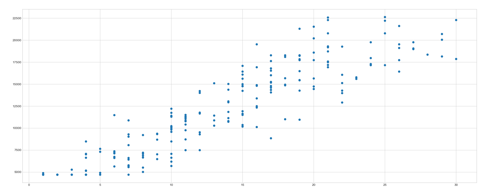
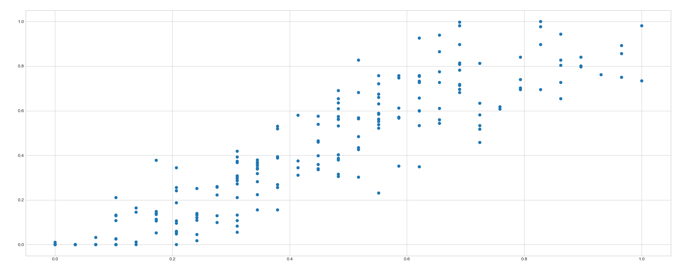

# Introduction to Intelligent systems
# Final project
> In this project, we will perform preliminary processing of the data set and then the selected data processing, and finally post-processing the results. 
The project will contain all the necessary comments and explanations. The data will also be visible for better understanding.
In order for it to run non-stop for presentation purposes only, we will assume that some manual action was taken where expected (i.e., data processing and decision making)

# Submitters:
[Andrey Dodon](https://www.kaggle.com/andreydodon) - `Afeka M.Sc. student, Intelligent systems`

[Michael Gudovsky](https://il.linkedin.com/in/michael-gudovsky-1392157b) - `Afeka M.Sc. student, Intelligent systems`


# Resources:
  - Libraries and plugins:
    * [pandas](https://pandas.pydata.org/)
    * [scikit-learn](https://scikit-learn.org/stable/)
    * [Statsmodel](https://www.statsmodels.org/stable/index.html)
    * [Matplotlib](https://matplotlib.org/)
    * [Seaborn](https://seaborn.pydata.org/)
    * [Math to Image](https://marketplace.visualstudio.com/items?itemName=MeowTeam.vscode-math-to-image)
  - IDE:
    * [PyCharm](https://www.jetbrains.com/pycharm/download/#section=windows)
    * [Anakonda](https://www.anaconda.com/products/individual)
    * [Visual Studio Code](https://code.visualstudio.com/download)
  

# Project brief:
- Preprocessing steps:
    * Loading the data
    * Investigation of the data
    * Handling missing values and dealing with outliers
    * Selection and normalization of the columns to be processed
    * Multicollinearity - a phenomenon in which two or more predictor variables 
						  in a multiple regression model are highly correlated, 
						  so that the coefficient estimates may change erratically 
						  in response to small changes in the model or data.
    * Dealing with Categorical Values
    * Standardization
- Processing:
    * Multiple Linear Regression
- Postprocessing metrics:
    * Precision
    * Recall
    * F1 Score
    * ROC AUC


# Loading the data:
A first impression of the data set we will be working with:
```
raw_data = pd.read_csv('data/dataUpdated.csv')
raw_data.shape
(200, 12)
```
Let's check the details
```
raw_data.describe(include='all')
```
|        |   userid |     gender |      age |   salary |   seniority (years) in comapny |   seniority in role(years) |   monthly return on loan |   how many children |   weight |   height |   grade in last year review (0-10) |   averaged grade of the BSC |
|:-------|---------:|-----------:|---------:|---------:|-------------------------------:|---------------------------:|-------------------------:|--------------------:|---------:|---------:|-----------------------------------:|----------------------------:|
| count  | 200      | 200        | 200      |   200    |                      200       |                   199      |            199           |           200       | 200      |      200 |                          199       |                    200      |
| unique | nan      | nan        | nan      |   nan    |                      nan       |                   nan      |            nan           |           nan       | nan      |       57 |                          nan       |                    nan      |
| top    | nan      | nan        | nan      |   nan    |                      nan       |                   nan      |            nan           |           nan       | nan      |      158 |                          nan       |                    nan      |
| freq   | nan      | nan        | nan      |   nan    |                      nan       |                   nan      |            nan           |           nan       | nan      |       11 |                          nan       |                    nan      |
| mean   | 100.5    |   0.475    |  46.27   | 12261.3  |                       13.805   |                    17.0452 |              3.90993e+06 |             2.375   |  70.49   |      nan |                            7.34673 |                     76.895  |
| std    |  57.8792 |   0.500628 |  13.7683 |  5220.62 |                        7.33183 |                    14.9042 |              5.51351e+07 |             1.52842 |  14.7389 |      nan |                            3.31897 |                     15.7848 |
| min    |   1      |   0        |  20      |  4700    |                        1       |                     1      |              0           |             0       |  41      |      nan |                           -8       |                     60      |
| 25%    |  50.75   |   0        |  35      |  7206.5  |                        8       |                     5      |            203           |             1       |  60      |      nan |                            5       |                     60      |
| 50%    | 100.5    |   0        |  47      | 11707    |                       14       |                    13      |            594           |             2       |  70      |      nan |                            9       |                     76      |
| 75%    | 150.25   |   1        |  58      | 16608.2  |                       19       |                    26      |           2048.5         |             3       |  79      |      nan |                           10       |                     92.25   |
| max    | 200      |   1        |  70      | 22624    |                       30       |                    70      |              7.77778e+08 |             8       | 111      |      nan |                           10       |                    100      |

A taste of the data
```
raw_data.head()
```
|    |   userid |   gender |   age |   salary |   seniority (years) in comapny |   seniority in role(years) |   monthly return on loan |   how many children |   weight |   height |   grade in last year review (0-10) |   averaged grade of the BSC |
|---:|---------:|---------:|------:|---------:|-------------------------------:|---------------------------:|-------------------------:|--------------------:|---------:|---------:|-----------------------------------:|----------------------------:|
|  0 |        1 |        1 |    49 |    14389 |                             14 |                         33 |                     1313 |                   1 |       83 |      196 |                                  6 |                          60 |
|  1 |        2 |        0 |    41 |     9322 |                              9 |                          9 |                      307 |                   3 |       79 |      176 |                                  8 |                          68 |
|  2 |        3 |        1 |    47 |    10354 |                             15 |                          9 |                       14 |                   4 |       73 |      167 |                                 10 |                          71 |
|  3 |        4 |        1 |    47 |    13383 |                             16 |                         16 |                     3009 |                   4 |       86 |      177 |                                  8 |                          72 |
|  4 |        5 |        0 |    36 |     6751 |                              6 |                         13 |                      224 |                   5 |       64 |      162 |                                  8 |                          92 |

Let's check the data types
```
raw_data.dtypes
```
|                                  | 0       |
|:---------------------------------|:--------|
| userid                           | int64   |
| gender                           | int64   |
| age                              | int64   |
| salary                           | int64   |
| seniority (years) in comapny     | int64   |
| seniority in role(years)         | float64 |
| monthly return on loan           | float64 |
| how many children                | int64   |
| weight                           | int64   |
| height                           | object  |
| grade in last year review (0-10) | float64 |
| averaged grade of the BSC        | int64   |

Not all columns in the table are numeric columns. Let's try to convert it.
```
data = raw_data.copy()
data = data.apply(pd.to_numeric, errors='coerce')
```
At first, we copy the data to keep the original data for future use, 
then we apply the conversion to a numeric type. 
Let's check the details again
```
data.describe(include='all')
```
|       |   userid |     gender |      age |   salary |   seniority (years) in comapny |   seniority in role(years) |   monthly return on loan |   how many children |   weight |   height |   grade in last year review (0-10) |   averaged grade of the BSC |
|:------|---------:|-----------:|---------:|---------:|-------------------------------:|---------------------------:|-------------------------:|--------------------:|---------:|---------:|-----------------------------------:|----------------------------:|
| count | 200      | 200        | 200      |   200    |                      200       |                   199      |            199           |           200       | 200      | 199      |                          199       |                    200      |
| mean  | 100.5    |   0.475    |  46.27   | 12261.3  |                       13.805   |                    17.0452 |              3.90993e+06 |             2.375   |  70.49   | 168.96   |                            7.34673 |                     76.895  |
| std   |  57.8792 |   0.500628 |  13.7683 |  5220.62 |                        7.33183 |                    14.9042 |              5.51351e+07 |             1.52842 |  14.7389 |  14.0399 |                            3.31897 |                     15.7848 |
| min   |   1      |   0        |  20      |  4700    |                        1       |                     1      |              0           |             0       |  41      | 132      |                           -8       |                     60      |
| 25%   |  50.75   |   0        |  35      |  7206.5  |                        8       |                     5      |            203           |             1       |  60      | 158      |                            5       |                     60      |
| 50%   | 100.5    |   0        |  47      | 11707    |                       14       |                    13      |            594           |             2       |  70      | 167      |                            9       |                     76      |
| 75%   | 150.25   |   1        |  58      | 16608.2  |                       19       |                    26      |           2048.5         |             3       |  79      | 180      |                           10       |                     92.25   |
| max   | 200      |   1        |  70      | 22624    |                       30       |                    70      |              7.77778e+08 |             8       | 111      | 204      |                           10       |                    100      |

# Investigation of the data:
Let's detect missing values if any
```
data.isna().sum()
```
|                                  |     |
|:---------------------------------|----:|
| userid                           |   0 |
| gender                           |   0 |
| age                              |   0 |
| salary                           |   0 |
| seniority (years) in comapny     |   0 |
| seniority in role(years)         |   1 |
| monthly return on loan           |   1 |
| how many children                |   0 |
| weight                           |   0 |
| height                           |   1 |
| grade in last year review (0-10) |   1 |
| averaged grade of the BSC        |   0 |

As per the requirements, 
we should try to replace the missing values with the column average. 
Let's do it
```
na_list = data.columns[data.isna().any()].tolist()
imp = SimpleImputer(missing_values=np.nan, strategy='mean')
imp.fit(data[na_list])
data[na_list] = imp.transform(data[na_list])
data.isna().sum()
```
|                                  |     |
|:---------------------------------|----:|
| userid                           |   0 |
| gender                           |   0 |
| age                              |   0 |
| salary                           |   0 |
| seniority (years) in comapny     |   0 |
| seniority in role(years)         |   0 |
| monthly return on loan           |   0 |
| how many children                |   0 |
| weight                           |   0 |
| height                           |   0 |
| grade in last year review (0-10) |   0 |
| averaged grade of the BSC        |   0 |

Let's check the number of non-NA/null observations in the data set
```
data.count()
```
|                                  |     |
|:---------------------------------|----:|
| userid                           | 200 |
| gender                           | 200 |
| age                              | 200 |
| salary                           | 200 |
| seniority (years) in comapny     | 200 |
| seniority in role(years)         | 200 |
| monthly return on loan           | 200 |
| how many children                | 200 |
| weight                           | 200 |
| height                           | 200 |
| grade in last year review (0-10) | 200 |
| averaged grade of the BSC        | 200 |


Let's check the dtypes of the data set
```
data.dtypes
```
|                                  |         |
|:---------------------------------|:--------|
| userid                           | int64   |
| gender                           | int64   |
| age                              | int64   |
| salary                           | int64   |
| seniority (years) in comapny     | int64   |
| seniority in role(years)         | float64 |
| monthly return on loan           | float64 |
| how many children                | int64   |
| weight                           | int64   |
| height                           | float64 |
| grade in last year review (0-10) | float64 |
| averaged grade of the BSC        | int64   |


All the data seem to be perfectly aligned. Now, let’s discover the data. We can use the describe method – 
if we use this method we will get only the descriptive statistics of the numerical features.
Since all the data in our data set is numeric it will work perfectly.
Let’s now analyze the basic statistical values of our dataset.
```
data.describe(include='all')
```
|       |   userid |     gender |      age |   salary |   seniority (years) in comapny |   seniority in role(years) |   monthly return on loan |   how many children |   weight |   height |   grade in last year review (0-10) |   averaged grade of the BSC |
|:------|---------:|-----------:|---------:|---------:|-------------------------------:|---------------------------:|-------------------------:|--------------------:|---------:|---------:|-----------------------------------:|----------------------------:|
| count | 200      | 200        | 200      |   200    |                      200       |                   200      |            200           |           200       | 200      | 200      |                          200       |                    200      |
| mean  | 100.5    |   0.475    |  46.27   | 12261.3  |                       13.805   |                    17.0452 |              3.90993e+06 |             2.375   |  70.49   | 168.96   |                            7.34673 |                     76.895  |
| std   |  57.8792 |   0.500628 |  13.7683 |  5220.62 |                        7.33183 |                    14.8667 |              5.49964e+07 |             1.52842 |  14.7389 |  14.0046 |                            3.31062 |                     15.7848 |
| min   |   1      |   0        |  20      |  4700    |                        1       |                     1      |              0           |             0       |  41      | 132      |                           -8       |                     60      |
| 25%   |  50.75   |   0        |  35      |  7206.5  |                        8       |                     5      |            203.5         |             1       |  60      | 158      |                            5       |                     60      |
| 50%   | 100.5    |   0        |  47      | 11707    |                       14       |                    13      |            594           |             2       |  70      | 167      |                            9       |                     76      |
| 75%   | 150.25   |   1        |  58      | 16608.2  |                       19       |                    26      |           2095.75        |             3       |  79      | 180      |                           10       |                     92.25   |
| max   | 200      |   1        |  70      | 22624    |                       30       |                    70      |              7.77778e+08 |             8       | 111      | 204      |                           10       |                    100      |

There seems to be a problem with the "seniority in role(years)" values.
Assume that the accepted minimum value will be: seniority in role <= seniority in company.
The second problematic area is "grade in last year review (0-10)" - 
there is a negative value in the field. Although there may be such obscure 
students who can get a negative score, 
in our case we will reset all the negative fields to 0
```
data['grade in last year review (0-10)'] = np.where(
    data['grade in last year review (0-10)'] < 0, 
    0, 
    data['grade in last year review (0-10)'])
```

# Handling missing values and dealing with outliers
Since we will work with regression, outliers are a significant issue, 
we must prepare the most perfect data set possible. After the deep investigation we did again, 
we decided to remove the column because the data displayed in it is unreliable.
As an alternative, we can adjust this to seniority in the company, 
but in this case, we will get almost identical columns.
Despite the fact that only two columns will be used for linear regression, 
it is always good to have the relevant data set filtered and prepared properly.
```
data = raw_data.copy()
data.drop('seniority in role(years)', axis='columns', inplace=True)
```
We now have the data set ready for the next steps

# Selection and normalization of the columns to be processed
The columns we will work with are: Salary and seniority in the company
As per the requirement, let's present it on the scatter graph
```
plt.style.use('seaborn-whitegrid')
plt.scatter(data['seniority (years) in comapny'],data['salary'], cmap=colours)
plt.show()
```



Let's normalize it.
The goal of normalization is to change the values of numeric columns in the dataset to a common scale, 
without distorting differences in the ranges of values. 
For machine learning, every dataset does not require normalization. 
It is required only when features have different ranges like in our case.
```
column_1 = 'seniority (years) in comapny'
column_2 = 'salary'

column_names_to_normalize = [column_1, column_2]
x = data[column_names_to_normalize].values

min_max_scaler = preprocessing.MinMaxScaler()
x_scaled = min_max_scaler.fit_transform(x)
data[column_names_to_normalize] = pd.DataFrame(x_scaled)
plt.scatter(data[column_1], data[column_2])
plt.show()
```


When we will do further analysis in the next steps, 
the attributed salary data will intrinsically influence the result more due to its larger value. 
But this doesn’t necessarily mean it is more important as a predictor. 
So we normalize the data to bring all the variables to the same range, as can be clearly seen

Let’s move on to the interesting part - where the magic happens
# Multiple Linear Regression
Multiple or multivariate linear regression is 
a case of linear regression with two or more independent variables
The estimated regression function has the equation:

Our goal is to calculate the optimal values of the predicted weights 

First thing first - let's import the class LinearRegression
```
from sklearn.linear_model import LinearRegression
```
Now, as we have already done in homework and as explained during some lesson,
Let's split our dataset into the training set and test set
```
from sklearn.model_selection import train_test_split
```
We use the “train_test_split” function to split our data. 
Here, we give the “test_size =0.2”, which indicates that 20% of the data is the test set.
```
X_train, X_test, y_train, y_test = train_test_split(real_data[:,0].reshape(-1,1), real_data[:,1], test_size=0.2)
```
Now we will assign a variable “regressor” to the LinearRegression class. 
We then use the “regressor.fit” to fit the training dataset (X_train and y_train) 
to this LinearRegression class for the training process to occur.
```
regressor = LinearRegression()
regressor.fit(X_train, y_train)
```
Let's predict the profit of the test set using the trained model namely “regressor”. 
The real values (profits) of the test set data(X_test) is stored in the variable y_test.
Let's use the “regressor.predict” function to predict the values 
for our test data X_test. We assign the predicted values as y_pred. 
We now have two data, y_test (real values) and y_pred (predicted values).
```
y_pred = regressor.predict(X_test)
```
Let's compare the tests set with predicted values
```
df = pd.DataFrame({'Real Values':y_test, 'Predicted Values':y_pred})
df.head()
```
|    |   Real Values |   Predicted Values |
|---:|--------------:|-------------------:|
|  0 |          7494 |           10524.8  |
|  1 |         15644 |           16354.5  |
|  2 |          4700 |            4047.28 |
|  3 |          5708 |            7933.77 |
|  4 |         17200 |           17002.3  |

Now, let's run the regression on the normalized data
```
X_train, X_test, y_train, y_test = train_test_split(normalized_data[column_1].values.reshape(-1, 1),
                                                    normalized_data[column_2].values,
                                                    test_size=0.2)
regressor.fit(X_train, y_train)
y_pred = regressor.predict(X_test)
df = pd.DataFrame({'Real Values': y_test, 'Predicted Values': y_pred})
print(df.head().to_markdown())
```
|    |   Real Values |   Predicted Values |
|---:|--------------:|-------------------:|
|  0 |     0.0479804 |          0.179328  |
|  1 |     0         |          0.0357898 |
|  2 |     0.657164  |          0.609942  |
|  3 |     0.22283   |          0.251097  |
|  4 |     0.38786   |          0.466404  |
Compared to the previous result we see that the model has closely predicted this 
value and hence we can say that our model has a good accuracy

Now, let's compare the details as requested, using sklearn library metrics.
We already defined the implementation of all the necessary metrics 
```
from sklearn import metrics
def all_metrics(y_test, y_pred):
    print('Mean absolute error: %.2f' % metrics.mean_absolute_error(y_test, y_pred))
    print('Mean squared error: %.2f' % metrics.mean_squared_error(y_test, y_pred))
    print('Coefficient of determination: %.2f' % metrics.r2_score(y_test, y_pred))
```


It is easy to see that the values obtained from non-normalized data 
contain non-informative values.

|                 |   Mean absolute error |   Mean squared error |  r2 score  |
|----------------:|----------------------:|---------------------:|-----------:|
|  non-normalized |      1875.95          |           5282298.84 |      0.82  |
|  normalized     |      0.10             |           0.01       |      0.78  |